# PS-PUCMG-StudentCoin
Trabalho Laboratório 03 Disciplina Projeto de Software

## Atividade Prática da Disciplina Projeto de Software

# Stack
[](https://kotlinlang.org/docs/home.html)
[](https://docs.spring.io/spring-boot/documentation.html)
[](https://docs.spring.io/spring-security/reference/index.html)
[](https://docs.spring.io/spring-security/reference/index.html)


[](https://ui.shadcn.com/docs/components)
[](https://tailwindcss.com/docs/installation/using-vite)
[](https://reactrouter.com/home)


[](https://sonarcloud.io/login)

[](https://sonarcloud.io/summary/new_code?id=jjoaom_PS-PUCMG-StudentCoin)
[](https://sonarcloud.io/summary/new_code?id=jjoaom_PS-PUCMG-StudentCoin)
[](https://sonarcloud.io/summary/new_code?id=jjoaom_PS-PUCMG-StudentCoin)
[](https://sonarcloud.io/summary/new_code?id=jjoaom_PS-PUCMG-StudentCoin)
[](https://sonarcloud.io/summary/new_code?id=jjoaom_PS-PUCMG-StudentCoin)
[](https://sonarcloud.io/summary/new_code?id=jjoaom_PS-PUCMG-StudentCoin)
[](https://sonarcloud.io/summary/new_code?id=jjoaom_PS-PUCMG-StudentCoin)
[](https://sonarcloud.io/summary/new_code?id=jjoaom_PS-PUCMG-StudentCoin)
[](https://sonarcloud.io/summary/new_code?id=jjoaom_PS-PUCMG-StudentCoin)


**O escopo da atividade por ser acessado [por aqui](./docs/LABORATÓRIO%2005%20-%20Sistema%20de%20Moeda%20Estudantil%20(Release%203).pdf).**

## Integrantes

- Diogo Henrique Moreira da Silva
- João Marcos de Aquino Gonçalves
- João Victor dos Santos Nogueira

## Professor

- João Paulo Aramuni

# Como rodar a aplicação

## Dev

Para rodar a aplicação em modo de desenvolvimento, acesse o terminal no diretório `/code` e digite:
```
docker-compose up
```
## Prod

Para rodar a aplicação em modo de produção, acesse o terminal no diretório `/code` e digite:
```
docker compose -f docker-compose.prod.yml up --build   
```

# Documentação

### Modelagem do sistema
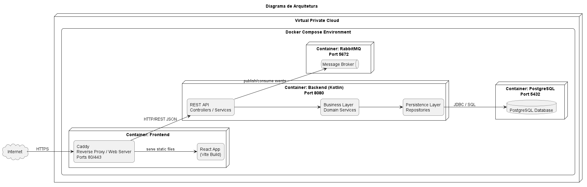

### Diagrama de Casos de Uso
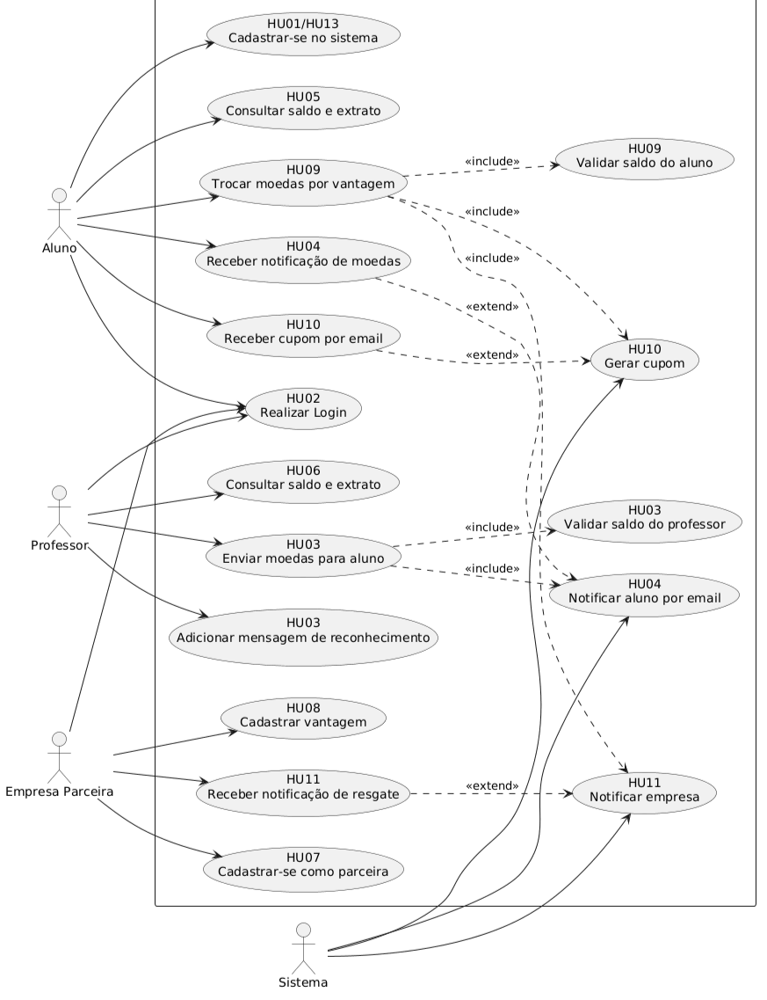

### Diagrama de Classes
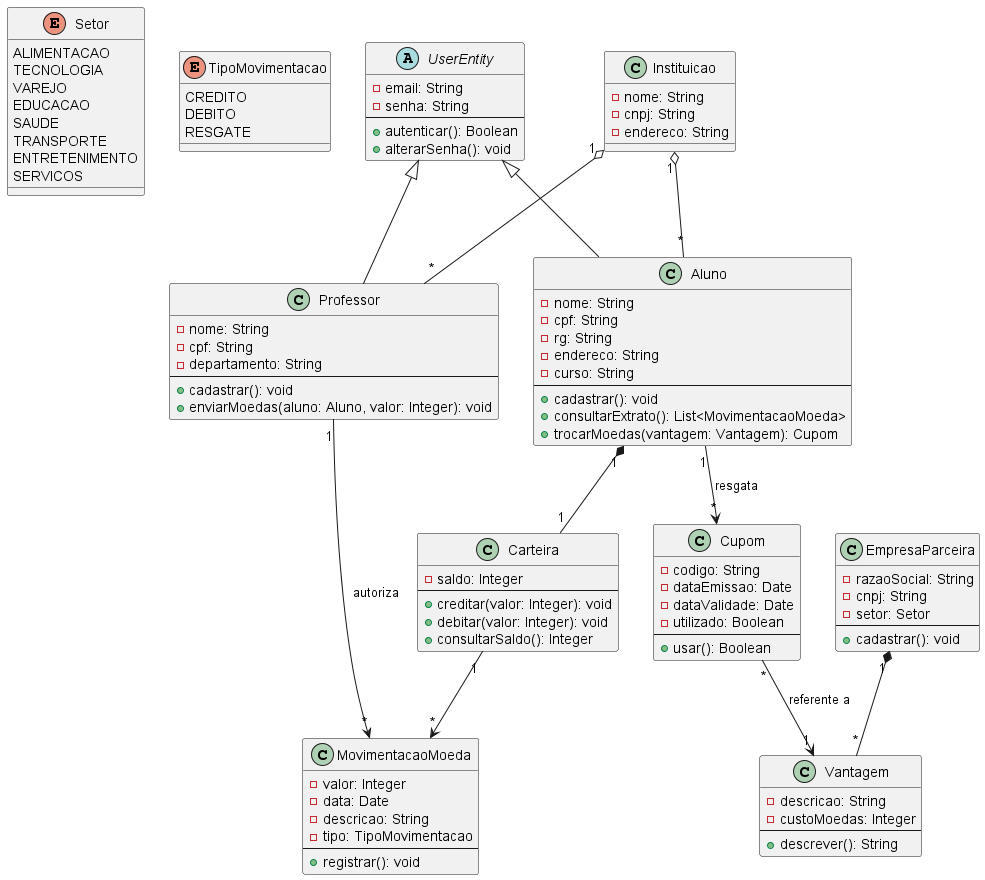

### Diagrama de Componentes
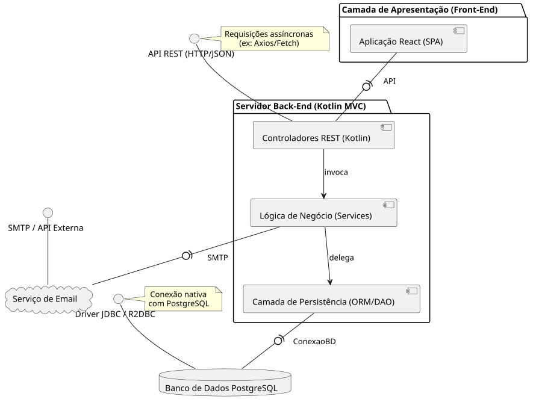

### Diagrama ER
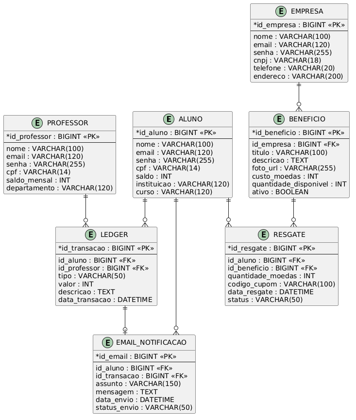

## Diagramas de Sequência

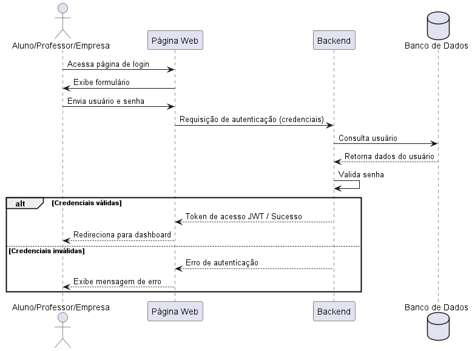

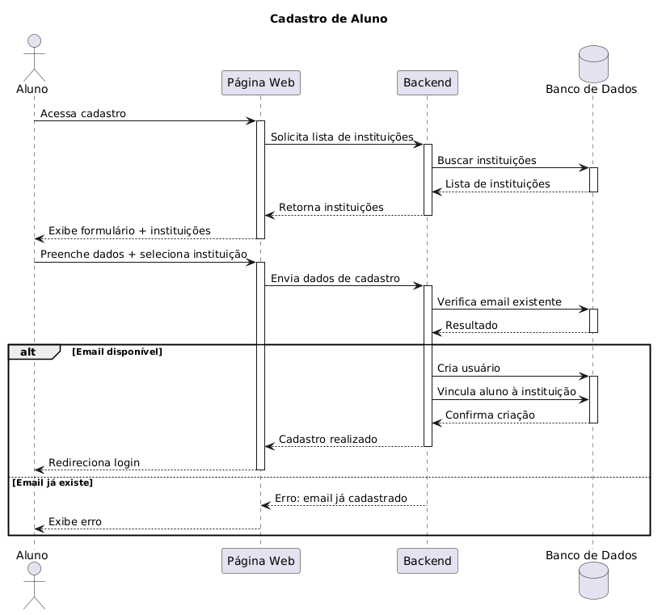

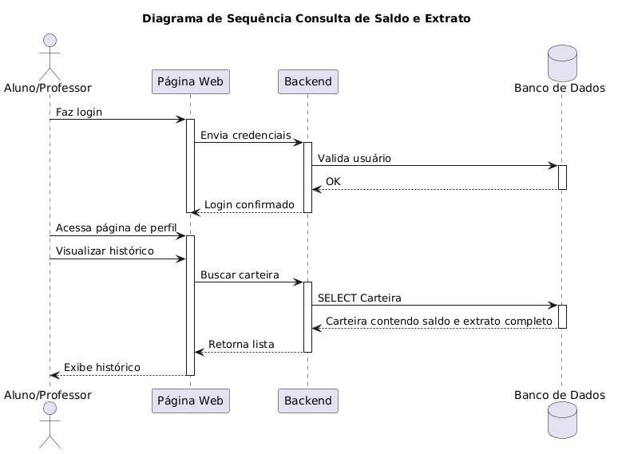

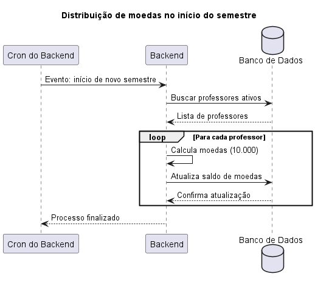

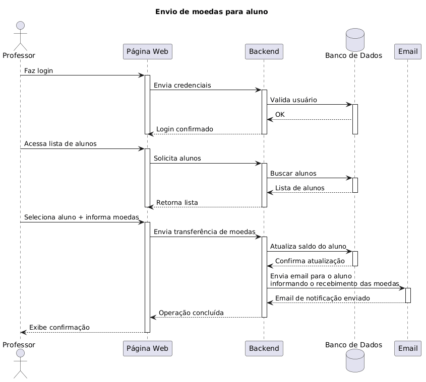

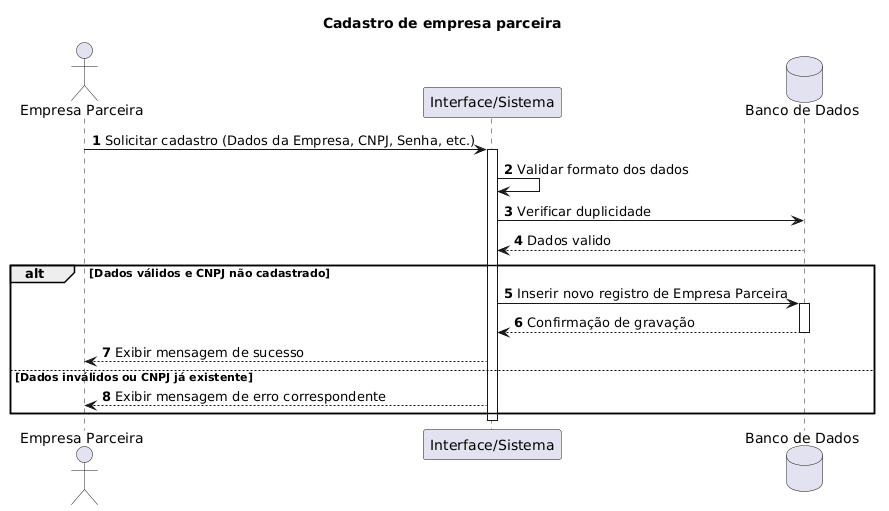


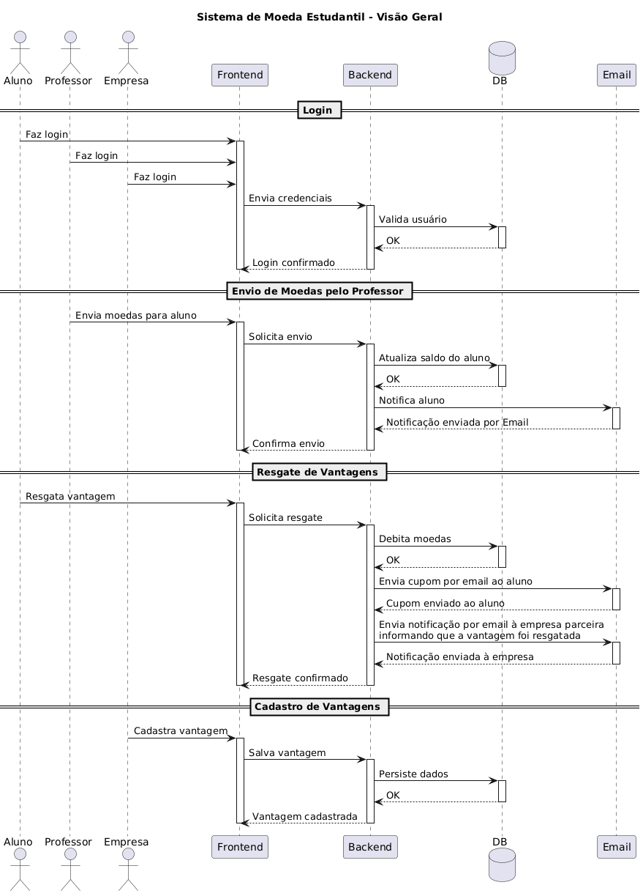

## Histórias do Usuário

**HU01**  
Como aluno, quero me cadastrar na plataforma, para participar do sistema de moeda estudantil.

**HU02**  
Como usuário, quero realizar login na plataforma, para acessar as funcionalidades do sistema.

**HU03**  
Como professor, quero enviar moedas para um aluno, para reconhecer seu desempenho e participação.

**HU04**  
Como aluno, quero receber notificação por email ao ganhar moedas, para saber quando fui recompensado.

**HU05**  
Como aluno, quero consultar meu saldo e extrato, para acompanhar minhas moedas recebidas e gastas.

**HU06**  
Como professor, quero consultar meu saldo e extrato, para acompanhar as moedas que distribuí.

**HU07**  
Como empresa parceira, quero me cadastrar na plataforma, para oferecer vantagens aos alunos.

**HU08**  
Como empresa parceira, quero cadastrar vantagens com descrição, foto e custo em moedas, para disponibilizar benefícios aos alunos.

**HU09**  
Como aluno, quero trocar minhas moedas por vantagens, para obter descontos ou produtos.

**HU10**  
Como aluno, quero receber um cupom por email após resgatar uma vantagem, para utilizá-la presencialmente.

**HU11**  
Como empresa parceira, quero receber notificação quando uma vantagem for resgatada, para validar o uso do benefício.

**HU12**  
Como professor, quero receber moedas automaticamente a cada semestre, para distribuí-las aos alunos.

**HU13**  
Como aluno, quero selecionar minha instituição no cadastro, para me vincular corretamente ao sistema.

* **Estratégia de Acesso ao Banco de Dados:** A estratégia de acesso ao banco utilizada no projeto foi ORM com JPA/Hibernate. As entidades Kotlin, como Aluno e Empresa, são mapeadas para tabelas do MySQL por meio das anotações @Entity e @Table. O acesso aos dados é feito por interfaces Repository que estendem JpaRepository, evitando SQL manual nas operações básicas de CRUD. O fluxo segue a arquitetura MVC, em que o Controller recebe as requisições, o Service aplica as regras de negócio e o Repository realiza a comunicação com o banco de dados.
